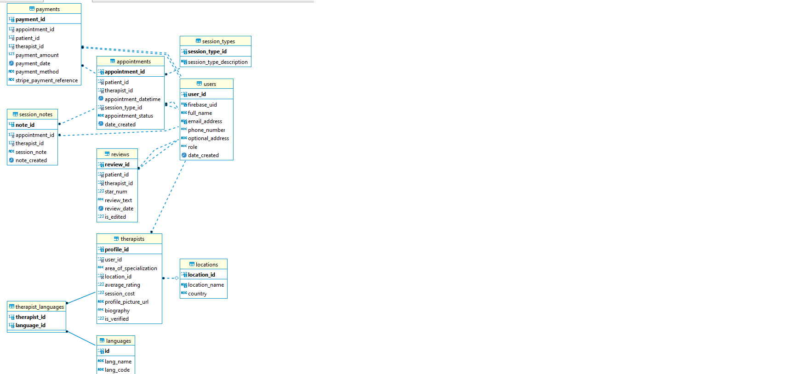

# Therapeutic Connection Platform


## Overview

The Therapeutic Connection Platform is a comprehensive web application designed to connect patients with therapists. This platform facilitates seamless interaction between patients and therapists, offering appointment scheduling, payment processing, and review management capabilities.

## Features

- **Therapist Profiles**: View detailed profiles of therapists including their specialties, experience, and availability
- **Search & Filtering**: Find therapists based on various criteria like specialty, location, and availability
- **Patient Reviews**: Read and leave reviews for therapists to help others make informed decisions
- **Review Management**: Admin panel for approving/rejecting patient reviews
- **Appointment System**: Schedule, reschedule, and cancel therapy appointments
- **Payment Integration**: Secure payment processing via Stripe API
- **User Management**: Admin panel to view and manage users from the Azure database
- **Location Selection**: Support for selecting from all 81 cities in Turkey for profile information

## Architecture



The platform follows a modern client-server architecture:

- **Frontend**: React.js for a responsive and interactive user interface
- **Backend**: Spring Boot for a robust and scalable API
- **Database**: Azure MySQL for data persistence
- **Authentication**: Firebase Authentication for secure user management
- **Payment Processing**: Stripe API for handling transactions
- **Styling**: Material-UI and custom CSS for a polished user experience

## Installation & Setup

### Prerequisites

- Java 11 or higher
- Node.js 14.x or higher
- npm 6.x or higher
- MySQL database (or Azure MySQL instance)
- Firebase project with Authentication enabled
- Stripe account for payment processing

### Backend Setup

1. Clone the repository:
   ```bash
   git clone https://github.com/yourusername/Therapeutic-Connection-Platform.git
   cd Therapeutic-Connection-Platform
   ```

2. Configure environment variables by copying `.env.example` to `.env`:
   ```bash
   cp .env.example .env
   ```

3. Update the `.env` file with your credentials:
   ```properties
   # Stripe Configuration
   STRIPE_API_KEY=your_stripe_api_key_here
   STRIPE_WEBHOOK_SECRET=your_stripe_webhook_secret_here

   # Firebase Configuration
   FIREBASE_CONFIG_FILE_PATH=path_to_your_firebase_config_json
   ```

4. Start the backend server:
   ```bash
   ./gradlew bootrun
   ```

### Frontend Setup

1. Navigate to the frontend directory:
   ```bash
   cd ui_react_therapeutic_platform
   ```

2. Install dependencies:
   ```bash
   npm install
   ```

3. Start the development server:
   ```bash
   npm start
   ```

The application should now be running at http://localhost:3000

## API Endpoints

### Authentication

- `POST /api/auth/register` - Register a new user
- `POST /api/auth/login` - Log in an existing user

### Therapists

- `GET /api/therapists` - Get all therapists
- `GET /api/therapists/{id}` - Get therapist by ID
- `POST /api/therapists` - Create a new therapist profile
- `PUT /api/therapists/{id}` - Update therapist profile
- `DELETE /api/therapists/{id}` - Delete therapist profile

### Reviews

- `GET /api/reviews` - Get all reviews
- `GET /api/reviews/{id}` - Get review by ID
- `POST /api/reviews` - Create a new review
- `PUT /api/reviews/{id}` - Update review
- `DELETE /api/reviews/{id}` - Delete review
- `PUT /api/reviews/{id}/approve` - Approve a review
- `PUT /api/reviews/{id}/reject` - Reject a review

### Appointments

- `GET /api/appointments` - Get all appointments
- `GET /api/appointments/{id}` - Get appointment by ID
- `POST /api/appointments` - Create a new appointment
- `PUT /api/appointments/{id}` - Update appointment
- `DELETE /api/appointments/{id}` - Cancel appointment

### Payment

- `POST /api/payment/create-customer` - Create a new Stripe customer
- `POST /api/payment/create-payment-intent` - Create a payment intent
- `POST /api/payment/confirm-payment-intent/{id}` - Confirm a payment intent
- `POST /api/payment/cancel-payment-intent/{id}` - Cancel a payment intent

## Admin Panel

The admin panel provides administrative functionality:

- **Review Management**: Approve or reject patient reviews
- **User Management**: View and filter users from Azure database
- **Therapist Management**: Manage therapist profiles

To access the admin panel:
1. Log in with an admin account
2. Navigate to the Admin Dashboard
3. Use the different sections to manage reviews, users, or therapists

## Testing

### Test Cards for Stripe

For testing the payment system, use Stripe's test cards:

- **Success Card**: 4242 4242 4242 4242
- **Requires Authentication**: 4000 0025 0000 3155
- **Decline**: 4000 0000 0000 0002

### Running Tests

To run backend tests:
```bash
./gradlew test
```

To run frontend tests:
```bash
cd ui_react_therapeutic_platform
npm test
```

## Firestore User Management

To view users from Firestore in your terminal:

1. Create and activate a Python virtual environment:
   ```bash
   python -m venv venv
   source venv/bin/activate
   ```
   
2. Install dependencies:
   ```bash
   pip install firebase-admin
   ```
   
3. Set up your Firebase config in `.env`
   
4. Run the script:
   ```bash
   python view_users.py
   ```

## Security Notes

- Never commit the `.env` file or Firebase configuration JSON to version control
- Always use environment variables for sensitive credentials
- Keep your API keys and service account files secure
- Rotate credentials if they are compromised

## Recent Updates

### 2024-07-11: Browser Tab Title and Logo Update
- Changed browser tab title from "React App" to "Therapeutic Connection Platform"
- Updated application favicon and logo visuals with new design
- Updated app manifest naming to "Therapeutic Connection Platform"

### 2024-07-09: Added Turkey Cities to Profile Page
- Added all 81 cities in Turkey to the location dropdown in Edit Profile page
- Easy selection of Turkey cities
- When a city is selected, the address is automatically saved in "City, Turkey" format

### 2024-07-08: Added in-app notification system using Material UI's Snackbar component for login success messages instead of browser alerts
- The notification appears as a top-center pop-up with auto-dismiss functionality
- Improved user experience with smooth transition between login and profile navigation

## Development Notes

When working with the Therapist model, note that the `isVirtual` field should be defined as object-type `Boolean` rather than primitive `boolean` to handle null values properly:

```java
@Column(name = "is_virtual")
private Boolean isVirtual;
```

## License

This project is licensed under the MIT License - see the [LICENSE](LICENSE) file for details.

## Contact

For questions or support, please contact the development team at [example@example.com](mailto:example@example.com).
